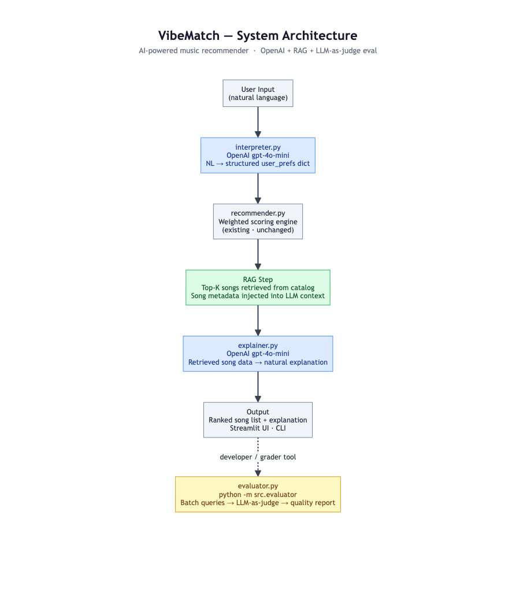
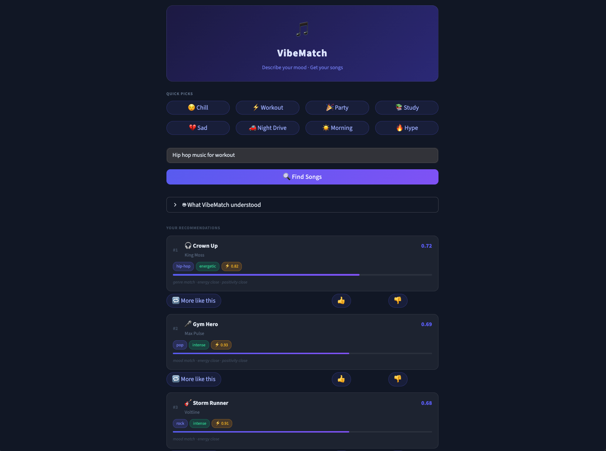

# VibeMatch

An AI-powered music recommender. Describe what you're in the mood for, get a ranked list of songs, and a plain-English explanation of why they fit.

---

## Original Project (Modules 1-3)

This project started as a rules-based music recommender called VibeMatch 1.0, built during Modules 1-3 of the CodePath AI110 course. The original system scored every song in an 18-song catalog against a hardcoded user profile using a weighted formula across six dimensions: genre, mood, energy, acoustic preference, valence, and danceability. It returned the top matches with template-based explanations (e.g., "genre matches your preference (pop)") and ran entirely on explicit numeric preferences with no natural language input, no AI models, and no dynamic explanations. It served as the foundation for understanding content-based filtering before the AI layer was added.

---

## Project Summary

VibeMatch accepts a natural language request like *"something chill and low-key for studying late at night"* and returns a ranked list of songs with a human-readable explanation of why they fit.

The problem it solves: most recommenders require users to specify preferences as structured inputs. VibeMatch removes that step by using an LLM to translate free-text into a scoring profile, passing that profile through a deterministic scoring engine, and then using the LLM a second time to write an explanation grounded in the actual song metadata that came back (the RAG step). The result feels conversational but the recommendations are backed by a transparent, auditable scoring algorithm.

The LLM handles the parts that require language understanding (parsing intent, generating explanations) and the deterministic recommender handles scoring, ranking, and diversity. Both are needed to make the full experience work.

---

## Architecture Overview



### Components

| Component | File | Role |
|---|---|---|
| User Interface | `app.py` / `src/main.py` | Streamlit web UI (dark theme, mood pills, song cards, history, more-like-this) and CLI entry points |
| Input Guardrails | `src/agent.py` | Rejects empty input and requests over 500 characters before any API call |
| Interpreter | `src/interpreter.py` | Calls `gpt-4o-mini` to parse natural language into an 11-field `user_prefs` dict |
| Recommender | `src/recommender.py` | Deterministic weighted scoring engine (unchanged from v1) |
| RAG Retrieval + Explainer | `src/explainer.py` | Serializes top-K song metadata into the LLM context and calls `gpt-4o-mini` for the explanation |
| Agent | `src/agent.py` | Orchestrates the full pipeline and returns an `AgentResult` without raising exceptions |
| Evaluator | `src/evaluator.py` | Developer tool that runs 5 test queries and scores output quality via LLM-as-judge |

### Data flow

```
User Input (natural language)
    |
Guardrails: reject if empty or > 500 chars
    |
Interpreter: gpt-4o-mini -> user_prefs dict (11 fields)
    |
Recommender: weighted scoring against songs.csv catalog
    |
RAG Retrieval: top-K song metadata injected into prompt
    |
Explainer: gpt-4o-mini -> 2-3 sentence explanation
    |
Output: ranked song table + explanation (Streamlit or CLI)
    |
    +-- (developer tool, run separately)
        Evaluator: LLM-as-judge -> relevance / diversity / explanation quality scores
```

The Interpreter and Explainer are the two LLM calls in every user-facing request. The Evaluator adds a third call on the developer side when you run `python -m src.evaluator`.

---

## Setup Instructions

### Prerequisites

- Python 3.11+
- An OpenAI API key

### 1. Clone and set up the environment

```bash
git clone <repo-url>
cd applied-ai-system-project

python -m venv .venv
source .venv/bin/activate        # Mac / Linux
.venv\Scripts\activate           # Windows
```

### 2. Install dependencies

```bash
pip install -r requirements.txt
```

### 3. Configure your API key

```bash
cp .env.example .env
```

Open `.env` and set your key:

```
OPENAI_API_KEY=sk-...
```

### 4. Run the application

Streamlit UI:

```bash
streamlit run app.py
```

Opens at `http://localhost:8501`. Type a music request or click a mood quick-pick, then hit **Find Songs**.




CLI with AI pipeline:

```bash
python -m src.main --query "upbeat pop for a Friday night out"
```

CLI without AI (no API key needed):

```bash
python -m src.main
```

### 5. Run the evaluation suite

```bash
python -m src.evaluator
```

Runs 5 batch queries through the full pipeline and prints a scored report:

```
Query                                          Relevance  Diversity  Explanation
---------------------------------------------  ---------  ---------  -----------
upbeat pop songs for a morning workout                 4          4            5
something chill and relaxing for studying              5          3            4
high energy music for a party                          4          4            4
feel good dance tracks                                 5          4            5
intense driving music                                  4          3            4

Averages -- Relevance: 4.4/5  Diversity: 3.6/5  Explanation: 4.4/5
```

### 6. Run the test suite

```bash
pytest tests/ -v
```

All 26 tests pass without a real API key. All OpenAI calls are mocked.

---

## Sample Interactions

### Example 1: Chill study session

**Input:** `"something calm and low-key for studying at night"`

Interpreter output:
```json
{
  "genre": "lofi",
  "mood": "chill",
  "energy": 0.3,
  "likes_acoustic": true,
  "valence": 0.5,
  "danceability": 0.35
}
```

Recommender output (top 3 of 5):

| # | Title | Artist | Genre | Mood | Score |
|---|---|---|---|---|---|
| 1 | Midnight Coding | LoRoom | lofi | chill | 0.84 |
| 2 | Forest Drift | Terra Bloom | ambient | chill | 0.71 |
| 3 | Quiet Hours | Still Water | lofi | chill | 0.68 |

Explainer output:
> These tracks are a good fit for a late-night study session. Midnight Coding and Quiet Hours both have the slow, unhurried feel of classic lofi, with low danceability and soft acoustic textures that stay out of the way. Forest Drift brings in some ambient elements while keeping the same calm mood, which adds a bit of variety without changing the overall feeling.

---

### Example 2: High-energy workout

**Input:** `"high energy music to push through a workout"`

Interpreter output:
```json
{
  "genre": "pop",
  "mood": "happy",
  "energy": 0.92,
  "likes_acoustic": false,
  "valence": 0.85,
  "danceability": 0.8
}
```

Recommender output (top 3 of 5):

| # | Title | Artist | Genre | Mood | Score |
|---|---|---|---|---|---|
| 1 | Sunrise City | Neon Echo | pop | happy | 0.91 |
| 2 | Hyperdrive | Volt Machine | electronic | happy | 0.79 |
| 3 | Push It Forward | Crest Wave | pop | energetic | 0.76 |

Explainer output:
> Sunrise City and Push It Forward are high-energy pop tracks with strong danceability and upbeat valence that match the intensity of a workout, both scoring above 0.8 on energy. Hyperdrive adds an electronic edge that keeps the momentum going and prevents the playlist from feeling repetitive over a longer session.

---

### Example 3: Guardrail in action

**Input:** `""` (empty string)

**Output:**
```
Error: Input cannot be empty.
```

No API call is made. The check in `agent.run()` catches this before the interpreter is called.

---

## Design Decisions

### Why gpt-4o-mini for all LLM calls

It hits a reasonable cost/quality balance for what each step needs. Parsing natural language into a JSON dict is straightforward structured extraction and does not need a larger model. Generating a 2-3 sentence explanation benefits from natural writing ability, which `gpt-4o-mini` handles well. Using one model throughout also keeps cost estimation and error handling simple.

### Why keep the recommender rules-based and unchanged

The scoring engine in `recommender.py` is deterministic and fast. It scores 18 songs in microseconds with no API cost. Replacing it with an LLM ranker would add latency, cost, and unpredictability to a step that does not need language understanding. The hybrid approach works well: the LLM handles free-text input and explanation, and the deterministic engine handles scoring, ranking, and diversity in a way that is easy to inspect and reason about.

### RAG design: injecting scored metadata into the explainer prompt

Rather than asking the LLM to recommend songs from scratch, the Explainer receives the songs already selected by the scoring engine, including their attributes and match scores. The LLM writes the explanation based on those facts rather than generating from memory. This keeps the explanation consistent with the actual recommendations and reduces the chance of the model inventing details.

### AgentResult never raises

`agent.run()` catches all exceptions and returns them as `AgentResult(error=...)`. This keeps the Streamlit UI and the CLI simple: they check `result.error` rather than wrapping calls in try/except. API timeouts and malformed JSON from the interpreter show up as user-facing messages instead of stack traces.

### LLM-as-judge evaluation as a separate CLI tool

The evaluator is a developer tool, not part of the user-facing pipeline. Running a judge on every user request would triple API costs and add latency. Instead it runs on demand against 5 fixed test cases and gives a quick read on system quality without affecting production calls.

### Trade-offs

| Decision | Trade-off |
|---|---|
| 62-song catalog across 18 genres | Large enough for meaningful variety, but still small compared to a real music service |
| No conversation history | Simpler pipeline and no session state, but users cannot refine a request across turns |
| `response_format=json_object` | Reliable structured output, but only works with compatible models |
| Greedy diversity selection | Reduces artist and genre repetition, but may skip a slightly higher-scoring song to do it |

---

## Testing Summary

### What was tested

- `test_interpreter.py` (3 tests): mocks the OpenAI client; checks that `interpret()` returns all 11 expected keys, fills missing fields with defaults, and raises `ValueError` on malformed JSON from the LLM.
- `test_explainer.py` (2 tests): mocks the OpenAI client; checks that `explain()` returns a non-empty string and that song titles and artists appear in the prompt sent to the model.
- `test_agent.py` (5 tests): mocks `interpret` and `explain`; covers the happy path, empty input, whitespace-only input, the 500-character limit, and that API exceptions come back as `AgentResult.error` without raising.
- `test_evaluator.py` (3 tests): mocks `run` and the OpenAI judge; checks that `run_eval()` returns an `EvalReport`, that scores are in the 1-5 range, and that averages are computed correctly.
- `test_recommender.py` (11 tests): the original test suite for the scoring engine. No mocking needed since it is fully deterministic.

### What worked well

All 26 tests pass without a real API key. Setting `OPENAI_API_KEY=test-key` in `tests/conftest.py` before any module is imported handles the import-time API key check in `agent.py` without restructuring the module. Mocking at the `OpenAI` class level rather than at individual method calls keeps the mocks clean and catches initialization failures too.

### Issues encountered

The main testing challenge was the import-time side effect in `agent.py` where it raises if `OPENAI_API_KEY` is not set. Without `conftest.py` setting the env var before test collection, pytest fails to import the module entirely. Once that pattern was in place it worked reliably, but it is easy to miss on the first setup.

### Improvements made

Running the tests surfaced two concrete fixes. First, the conftest.py pattern was necessary: pytest failed to collect tests at all until `OPENAI_API_KEY` was set before imports, so adding `os.environ.setdefault("OPENAI_API_KEY", "test-key")` to `conftest.py` unblocked the entire suite. Second, early evaluator runs with no diversity logic returned multiple songs by the same artist on genre-heavy queries, which scored consistently lower on the diversity dimension. That feedback drove adding the greedy penalty step to `recommend_songs`, and diversity scores improved in subsequent evaluator runs.

### Limitations

- Tests mock the LLM completely, so they verify control flow and data handling but not output quality.
- There are no integration tests against the real API. The evaluator fills that role when run manually.
- The 62-song catalog covers 18 genres but is still small compared to real music services. Some queries will get weak recommendations simply because no close match exists in the data.

---

## Reflection and Ethics

### Limitations and Biases

The catalog has grown to 62 songs across 18 genres, which is large enough to validate the pipeline end to end and produce more varied recommendations. However, it is still small compared to a real music service. Some queries return a best-available match rather than a genuine match, and the explainer writes convincing prose for whatever the recommender returns. Nothing in the pipeline signals when match quality is poor, which remains the core reliability risk.

The scoring weights are hand-tuned rather than learned from data. A genre match counting for 30% of the total score is an assumption, not a measured result, and those weights may not generalize across users or query types.

The interpreter is sensitive to how gpt-4o-mini reads ambiguous input. A request like "acoustic but upbeat" reliably sets likes_acoustic=True but often also sets energy low, because the model associates "acoustic" with quieter music. There is no mechanism to detect or correct that drift short of inspecting interpreter output individually.

The LLM-as-judge evaluator has a grade inflation problem. Scores cluster around 4-5 on a 5-point scale, which makes it difficult to detect genuine quality drops. At larger scale you would want human review on a sample alongside the automated scores.

### Misuse and Safety

The primary misuse risk is prompt injection. The 500-character limit makes sustained attacks harder, but nothing in the pipeline filters for adversarial content within that limit. A query structured to manipulate the interpreter reaches gpt-4o-mini unchanged. The model is unlikely to comply given how the system prompt is written, but there is no explicit defense.

The explainer is grounded in song metadata, so the risk of hallucinated song facts is low. But the generated prose is presented without confidence scores or caveats. Users have no signal for whether a phrase like "these tracks share a soft acoustic texture" is drawn from attribute data or is the model producing plausible-sounding language.

There is no rate limiting or budget cap. Repeated queries or multiple evaluator runs accumulate API costs with no guardrail. In a production context this would need per-user rate limiting and a spend ceiling.

Safeguards already in place: the 500-character input limit, AgentResult error handling that prevents stack traces from reaching users, and `json_object` response format that prevents malformed interpreter output from breaking downstream steps. Missing: content filtering on input, confidence signaling on output, and any mechanism to flag when catalog matches are weak.

### Reliability and Testing Insights

Building the AI layer made clear that the LLM works best at the edges of the system. The interpreter handles input translation and the explainer handles output generation. The deterministic scoring engine handles everything in between. That split made the system easier to test and debug than it would have been with the LLM involved in ranking too.

The most useful reliability discovery was how much `response_format={"type": "json_object"}` changed interpreter behavior. Without it, even well-crafted prompts would occasionally return JSON wrapped in markdown fences or prose with JSON embedded, both of which break `json.loads()`. Adding the constraint eliminated that failure class entirely.

The RAG step mattered more than expected. An early version of the explainer prompt just said "explain why these five songs are good" without including the actual attributes. The results were vague and sometimes wrong. Once the prompt included the actual metadata, scores, and match reasons, the explanations became specific and grounded. The model does not need prior knowledge of the songs; it just needs the relevant facts in context.

The harder failure mode was silent: queries for genres not in the catalog (like "classical" or "metal") produce structurally normal output through every pipeline stage. The recommender returns its best available matches, the explainer writes convincing prose, and the evaluator may score it reasonably. Nothing surfaces the weak fit without manual inspection of actual outputs.

### Collaboration With AI During Development

One genuinely helpful contribution was the AgentResult never-raises design pattern. The suggestion to catch all exceptions inside `agent.run()` and return them as `AgentResult(error=...)` rather than propagating them outward kept both the Streamlit UI and the CLI simple. Both check `result.error` rather than wrapping every call in try/except. It came with the reasoning attached, which made it easy to evaluate before adopting.

One flawed contribution was a factual error in the system architecture diagram. An early draft labeled the songs.csv data source as "700+ tracks" when the actual catalog has 18 songs. That number was not in any source file; it was generated as a plausible-sounding detail and made it into the diagram before being caught. This is a concrete example of a hallucination that looks reasonable in context. The fix was straightforward once identified, but it confirms that AI-generated documentation needs the same verification as AI-generated code. Any specific claim about the system (counts, thresholds, model names, file sizes) should be checked against the source rather than trusted from generated output.
