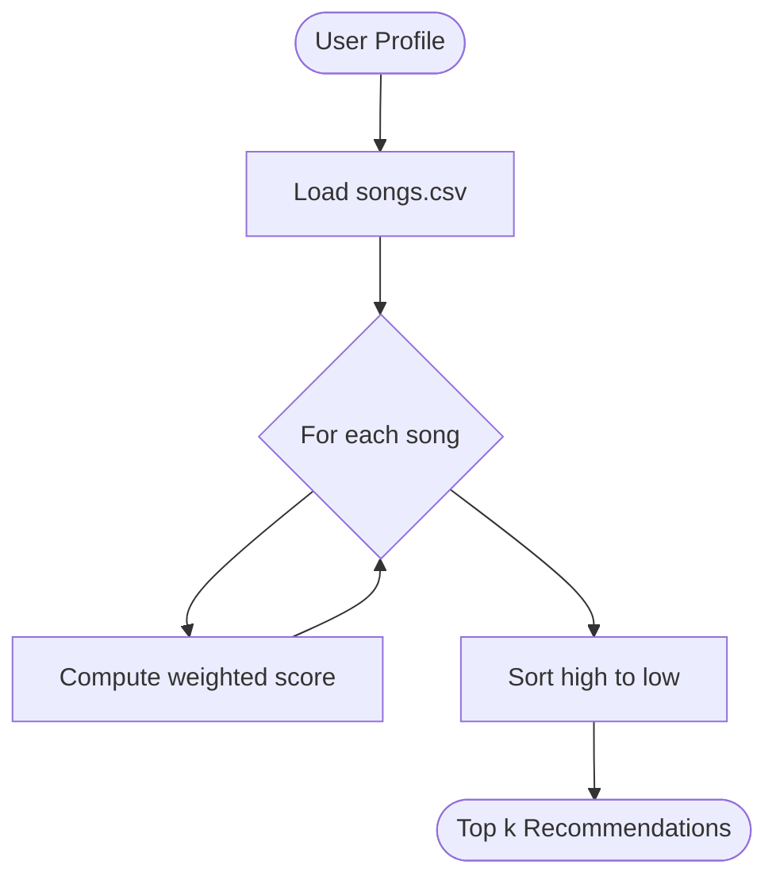

# 🎵 Music Recommender Simulation

## Project Summary

In this project you will build and explain a small music recommender system.

Your goal is to:

- Represent songs and a user "taste profile" as data
- Design a scoring rule that turns that data into recommendations
- Evaluate what your system gets right and wrong
- Reflect on how this mirrors real world AI recommenders

Replace this paragraph with your own summary of what your version does.

---

## How The System Works

Real-world music recommenders use two main strategies. *Collaborative filtering* finds users with similar listening histories and recommends what those users liked — it doesn't need to understand the songs, just patterns in human behavior. *Content-based filtering* analyzes the attributes of songs themselves and finds songs whose characteristics match a user's stated preferences.

This system uses **content-based filtering**. Each song is scored against the user's profile using a weighted formula, then songs are ranked by score and the top results are returned.

### Song Features

| Feature | Type | Description |
|---|---|---|
| `genre` | categorical | Style of music (pop, r&b, hip-hop, rock, metal, country, folk, jazz, lofi, electronic, ambient, synthwave, indie pop) |
| `mood` | categorical | Emotional context (happy, chill, intense, relaxed, focused, moody, romantic, energetic, nostalgic, melancholic, sad) |
| `energy` | float 0–1 | Intensity level |
| `valence` | float 0–1 | Musical positivity — high = upbeat, low = melancholic |
| `danceability` | float 0–1 | Rhythmic suitability for dancing |
| `acousticness` | float 0–1 | Acoustic vs. electronic character |
| `tempo_bpm` | float | Beats per minute (stored, not scored) |

### User Profile

| Field | Type | Description |
|---|---|---|
| `favorite_genre` | str | Preferred genre |
| `favorite_mood` | str | Preferred mood context |
| `target_energy` | float 0–1 | Preferred energy level |
| `likes_acoustic` | bool | Prefers acoustic over electronic |
| `target_valence` | float 0–1 | Preferred positivity level (default 0.5) |
| `target_danceability` | float 0–1 | Preferred danceability level (default 0.5) |

### Algorithm Recipe (Scoring Formula)

Each song receives a weighted compatibility score (max = 1.0):

| Feature | Weight | Formula |
|---|---|---|
| Genre match | **30%** | `1.0` if match, `0.0` if not |
| Mood match | **25%** | `1.0` if match, `0.0` if not |
| Energy similarity | **20%** | `1.0 - \|song.energy - user.target_energy\|` |
| Acoustic fit | **10%** | `acousticness` if user likes acoustic, else `1 - acousticness` |
| Valence similarity | **10%** | `1.0 - \|song.valence - user.target_valence\|` |
| Danceability similarity | **5%** | `1.0 - \|song.danceability - user.target_danceability\|` |

Songs are sorted highest to lowest by score, and the top `k` are returned with explanations.

### System Diagram



### Potential Biases

- **Genre over-dominance**: genre carries 30% weight, so a near-perfect song in the wrong genre will always rank below a mediocre song in the right genre.
- **Cold-start limitations**: the system needs explicit preferences — it can't infer taste from behavior.
- **Binary genre/mood matching**: there are no partial matches (e.g., "pop" and "indie pop" score the same as "pop" and "metal" — both zero).
- **Limited catalog**: 18 songs means some user profiles will get weak recommendations simply because no good match exists.

---

## Getting Started

### Setup

1. Create a virtual environment (optional but recommended):

   ```bash
   python -m venv .venv
   source .venv/bin/activate      # Mac or Linux
   .venv\Scripts\activate         # Windows

2. Install dependencies

```bash
pip install -r requirements.txt
```

3. Run the app:

```bash
python -m src.main
```

### Running Tests

Run the starter tests with:

```bash
pytest
```

You can add more tests in `tests/test_recommender.py`.

---

## Experiments You Tried

Use this section to document the experiments you ran. For example:

- What happened when you changed the weight on genre from 2.0 to 0.5
- What happened when you added tempo or valence to the score
- How did your system behave for different types of users

---

## Limitations and Risks

Summarize some limitations of your recommender.

Examples:

- It only works on a tiny catalog
- It does not understand lyrics or language
- It might over favor one genre or mood

You will go deeper on this in your model card.

---

## Reflection

Read and complete `model_card.md`:

[**Model Card**](model_card.md)

Write 1 to 2 paragraphs here about what you learned:

- about how recommenders turn data into predictions
- about where bias or unfairness could show up in systems like this


---

## 7. `model_card_template.md`

Combines reflection and model card framing from the Module 3 guidance. :contentReference[oaicite:2]{index=2}  

```markdown
# 🎧 Model Card - Music Recommender Simulation

## 1. Model Name

Give your recommender a name, for example:

> VibeFinder 1.0

---

## 2. Intended Use

- What is this system trying to do
- Who is it for

Example:

> This model suggests 3 to 5 songs from a small catalog based on a user's preferred genre, mood, and energy level. It is for classroom exploration only, not for real users.

---

## 3. How It Works (Short Explanation)

Describe your scoring logic in plain language.

- What features of each song does it consider
- What information about the user does it use
- How does it turn those into a number

Try to avoid code in this section, treat it like an explanation to a non programmer.

---

## 4. Data

Describe your dataset.

- How many songs are in `data/songs.csv`
- Did you add or remove any songs
- What kinds of genres or moods are represented
- Whose taste does this data mostly reflect

---

## 5. Strengths

Where does your recommender work well

You can think about:
- Situations where the top results "felt right"
- Particular user profiles it served well
- Simplicity or transparency benefits

---

## 6. Limitations and Bias

Where does your recommender struggle

Some prompts:
- Does it ignore some genres or moods
- Does it treat all users as if they have the same taste shape
- Is it biased toward high energy or one genre by default
- How could this be unfair if used in a real product

---

## 7. Evaluation

How did you check your system

Examples:
- You tried multiple user profiles and wrote down whether the results matched your expectations
- You compared your simulation to what a real app like Spotify or YouTube tends to recommend
- You wrote tests for your scoring logic

You do not need a numeric metric, but if you used one, explain what it measures.

---

## 8. Future Work

If you had more time, how would you improve this recommender

Examples:

- Add support for multiple users and "group vibe" recommendations
- Balance diversity of songs instead of always picking the closest match
- Use more features, like tempo ranges or lyric themes

---

## 9. Personal Reflection

A few sentences about what you learned:

- What surprised you about how your system behaved
- How did building this change how you think about real music recommenders
- Where do you think human judgment still matters, even if the model seems "smart"

